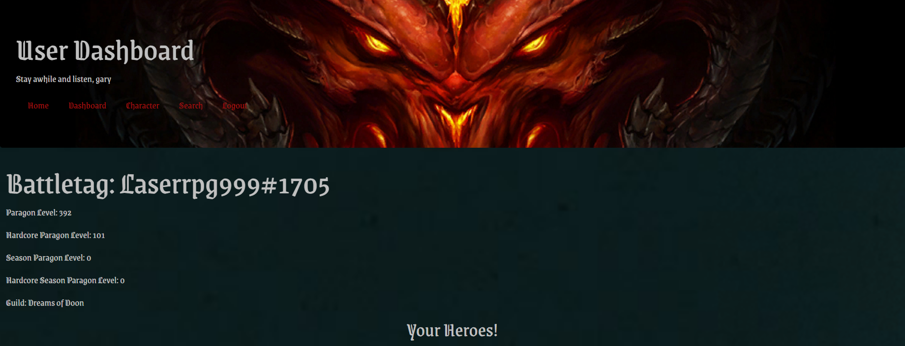

# Diablo Source  
  
## Description  
  
This is a single-page React-built Diablo resource utilizing the official Blizzard API for users to access and save fellow player and character information.  
  
## Table of Contents  
- ### [Installation](#installation)
- ### [Technology Stack](#technology-stack)
- ### [Usage](#usage)
- ### [Screenshots](#screenshots)
- ### [Contributing](#contributing)
- ### [Questions](#questions)
  
## Installation  
  
No installation necessary; just visit the link in the [Usage](#usage) section below.  
  
## Technology Stack  
  
* MongoDB
* Express
* ReactJS
* NodeJS
* bcrypt
* JSON Web Token
* Mongoose
* HTML5
* CSS3
* ES6+
* Blizzard API
    
## Usage  
  
Users can sign-up to create an account with or without a BattleTag and search for other players or their characters and save them to their account for even easier access later. If the user provides a BattleTag with their sign-up, they can look at their own account and player information by default. Seasonal Leaderboards are accessed and displayed live on-load.
  
Check out the [deployed app](https://desolate-chamber-11891.herokuapp.com/).  
  
## Screenshots  
  
  
---  
  
  
  
  
---  
  
  
  
  
## Contributing  
  
Jacob Beckfeld, Neil Burt, Zachary Guldberg, Calvin Li  
  
## Questions  
  
If you have any additional questions:  
  
Visit our GitHub profiles:  
[Jacob Beckfeld](https://github.com/JacobBeckfeld)  
[Neil Burt](https://github.com/neilburt)  
[Zachary Guldberg](https://github.com/zacharyjg00)  
[Calvin Li](https://github.com/calvinli23)  
  
Or you can email us:  
[Jacob Beckfeld](mailto:jacbeck456@gmail.com)  
[Neil Burt](mailto:neil.burt@comcast.net)  
[Zachary Guldberg](mailto:zacharyjg00@gmail.com)  
[Calvin Li](mailto:calvinli12345@gmail.com)  

## TODO

- Add linking between saved battletags and when clicked will render a search with the results for the saved battletags
- Remove usage of localStorage when linking character cards to the character page and leverage appContext or Redux instead
- Implement test code using Jest
- Formatting UI and making everything more intuitive
- Get the hero name to display properly on the leaderboard
- Refactor repetitive code